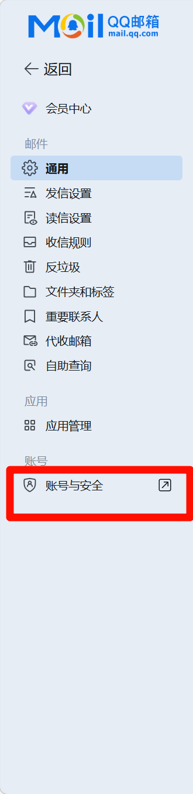
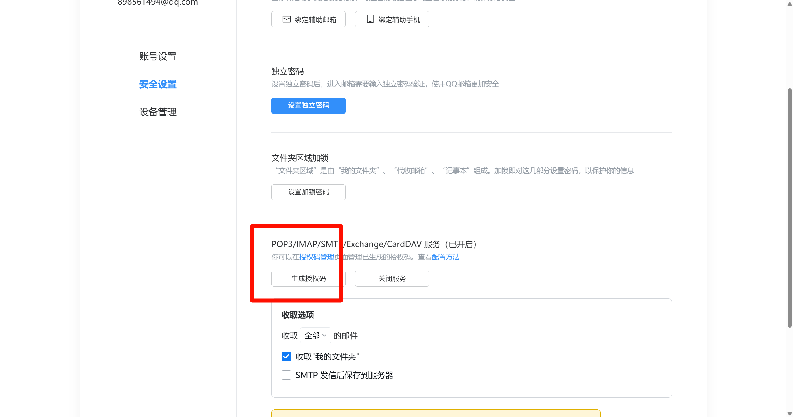
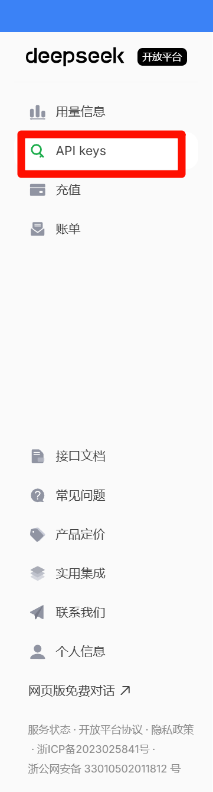
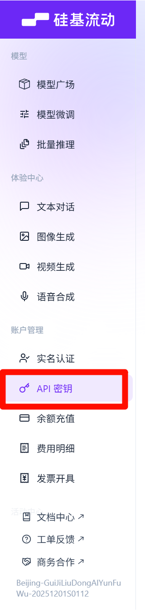
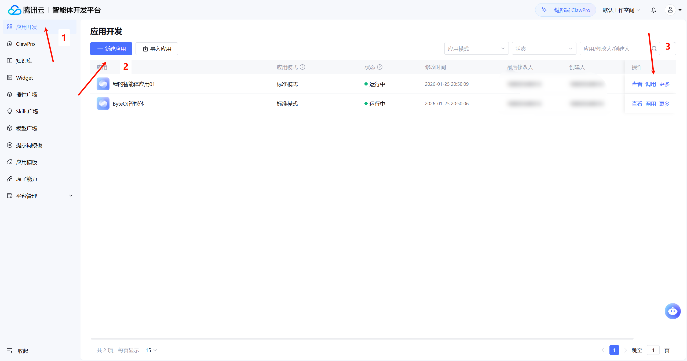
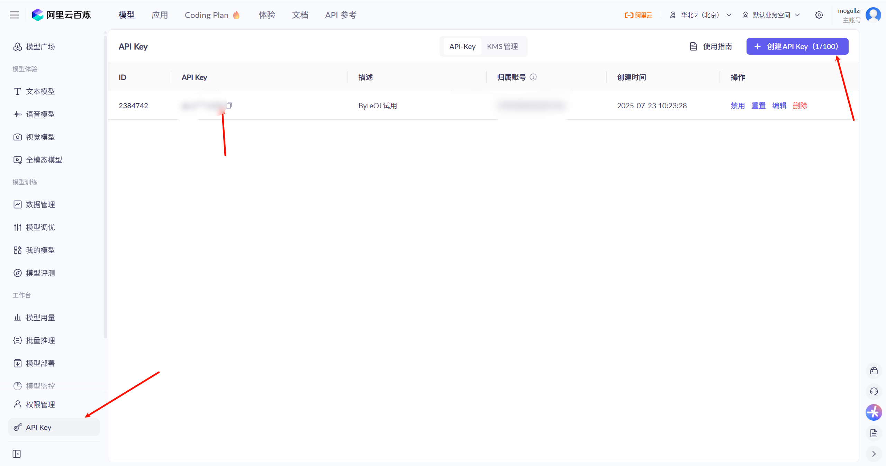
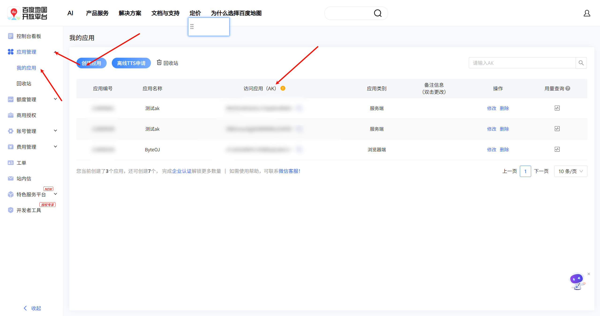
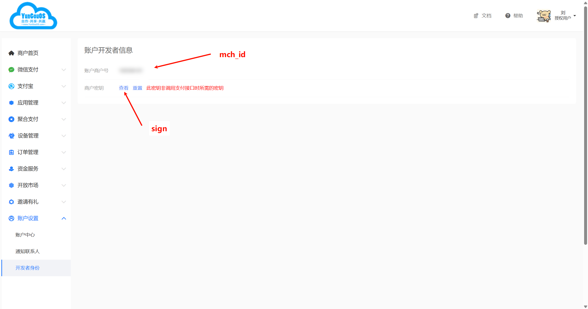

## 一、后端配置环境要求(本地运行)
- MySQL最好8.0++，没有配置过8.0以下版本
- Redis我用的是5.0.14，6+版本大概率不行
- RabbitMQ我是用的是3.12.1版本的
- JDK 17最好
- Maven构建(自己是这样，你改造为Gradle也行)
- 沙箱服务(需要使用本人的镜像，未来再看是否开放，没有这个代码调试/提交功能 没用)

## 二、前置工作
- 把`/sql/*`里面所有的`sql`文件夹导入数据库当中去即可（仅仅留下了部分数学/408/政治真题的sql数据）
- 前端调通。前端`Github`链接为[进入入口](https://github.com/mogullzr/byteoj_fronted) 
 
## 三、application-test.yml一些配置项说明
### hm.mail.password
> 这个信息需要你登录你的QQ邮箱并且下图的账号与安全中找到

### hm.ai.api.v3-1.key
> 这个信息需要你登录[官网](https://www.deepseek.com)
> 然后再进入[个人中心](https://platform.deepseek.com/api_keys)

### hm.ai.api.v3-2.key/hm.ai.api.r1_1.key/hm.ai.api.Qwen-VL.key
> 需要你登录[硅基流动](https://account.siliconflow.cn/zh/login)
> 然后进入[页面](https://cloud.siliconflow.cn/me/account/ak)获取密钥

### hm.ai.api.v3-tenCloud.key
> 需要你登录[腾讯云](https://console.cloud.tencent.com/)
> 然后进入[页面](https://adp.cloud.tencent.com/adp?spaceId=default_space#/app/home?spaceId=default_space),然后按照下面步骤走即可

### hm.aliyun.oss.*
> 这里的一系列信息如何填写可以参考[文章](https://blog.csdn.net/m0_51963973/article/details/131067432)

### hm.aliyun.vod.*
> 这里的两个信息可以和hm.aliyun.oss.*里面的两个对应上

### hm.aliyun.embedding.accessKeyId
> 先登录[阿里云](https://www.aliyun.com/)
> 紧接着进入[api_key页面](https://bailian.console.aliyun.com/cn-beijing?tab=model#/api-key)

### baidu.ipService.ak
> 登录官网后，再进入该[页面](https://lbsyun.baidu.com/apiconsole/key)

### qq.*
> 简单讲可以不填写

### weChat.mch_id/weChat.sign
> 登录YunGouOS之后进入[页面](https://www.yungouos.com/#/user/developer)

### lantu.*
> 简单讲请之前没有和蓝图支付签过约的开发人员不管了
> 但是课程支付功能的二维码支付功能会失效，加入课程需要管理员自己添加用户

# 四、线上环境
> 主要需要修改好docker-compose.yml文件
> 里面需要你自己设定的信息已经有了详细描述，应该无其他问题。如有问题可以咨询以下898561494@qq.com